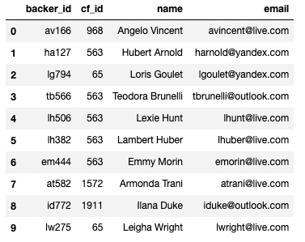
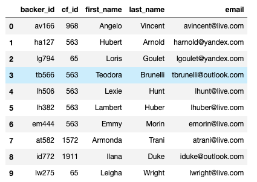

# Crowdfunding-ETL
Module 8 - ETL

## Overview of the analysis:

### Deliverable 1: Extract Data

Using the python dictionary method I extracted the data from the backer_info.csv file into a DataFrame. 

### Deliverable 2: Transform and Clean Data

Using the python to split up columns and re-organize them to produced the cleaned backers DataFrame below. The column name was also dropped. 

### Deliverable 3: Create an ERD and a Table Schema and Load the Data

Updating the ERD map to include the new backers table. Through reviewing the backer tables properties, I was able to succesfully import the csv into the table. 

## Summary:

      -- Create Table to show elibible employees count
      SELECT COUNT(me.title), me.title
      -- INTO mentor_elig_count
      FROM mentorship_elig as me
      GROUP BY me.title 
      ORDER BY me.count DESC;

      -- Create Table to show elibible employees sum
      SELECT SUM(count)
      FROM mentor_elig_count;

   
   
